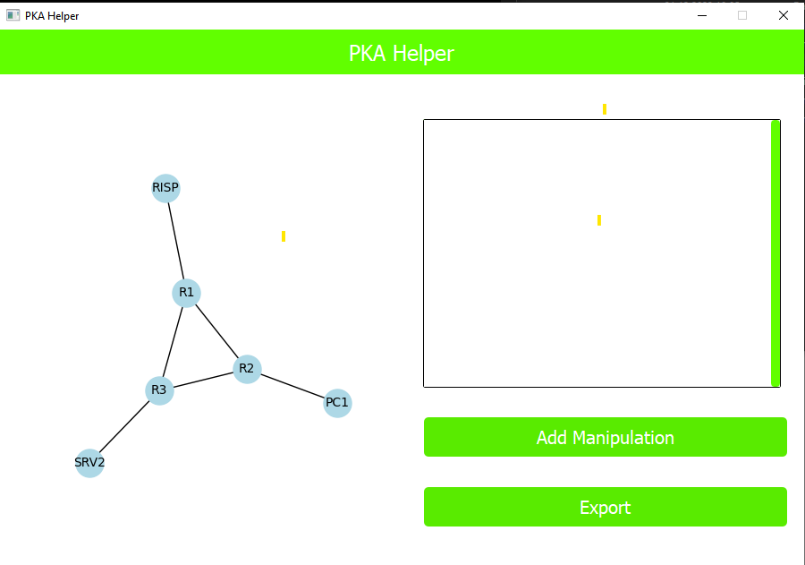
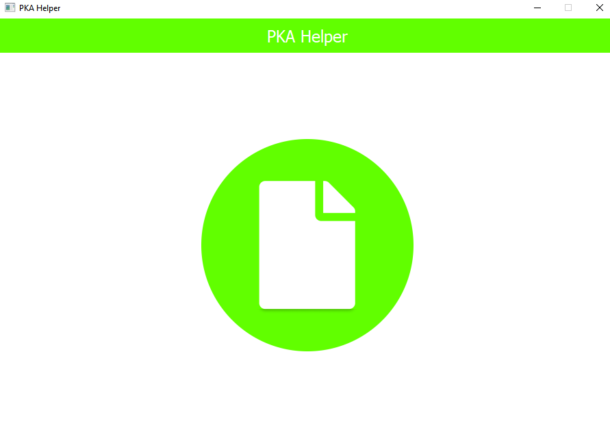
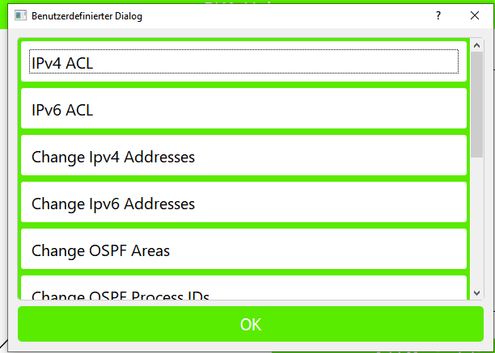
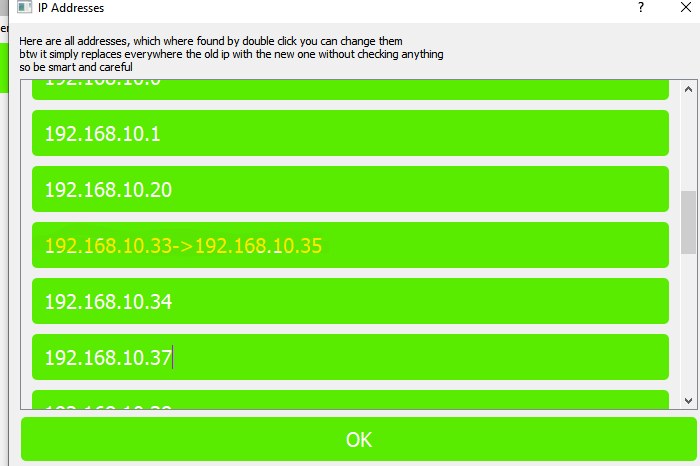
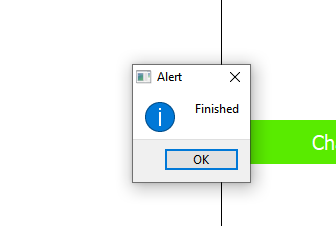

## PTHelper



The aim of this project is to make it easy to cheat in Packet Tracer activities.
This was a small side project, so the code is not thoroughly tested and is a bit messy.

The workflow is simple: you obtain the solved exercise and manipulate the file so it appears as if you completed it yourself.

This code is based on the amazing work of mircodezorzi:
[https://github.com/mircodezorzi/pka2xml](https://github.com/mircodezorzi/pka2xml)

He is a hero!!!

### It's not a virus

<br>
Just click **More** and then **Execute**. It’s open source, so you can verify what you’re running.

### Warning

The **Device Switch** should always be used alone without other manipulations; otherwise, errors may occur.

If you use the Device Switch, perform the export in **two steps**.

### Install

#### Windows install

1. Download the newest release.
2. Execute **PtHelper.exe** or **Gui2.exe**.

   * Keep in mind that you also need the **internal** folder. Don’t delete it.

#### Platform independent

1. Python 3.9.7

```shell
py -m venv pka_env
pka_env\Scripts\activate
pip install pyinstaller PyQt5 docker lxml importlib-metadata matplotlib networkx
py Gui2.py
```

2. Install Docker and make sure the daemon is running.
3. On Linux, permission handling can be tricky (the Docker container may create files under one user while the application accesses them under another, and the app still needs to control the Docker daemon). Keep permissions in mind. If you don’t care, just use `sudo` (or, depending on the distro, `sudo -s` before execution).

A possible improvement would be to perform Linux decryption and encryption natively as well.

### Description

This project allows you to cheat in any Packet Tracer activity you need to. If functionalities are missing, you can easily implement them yourself—and hopefully contribute to this project. :)

After starting, you’ll see the start screen. Click the big button in the middle and select your start file (the activity file or a colleague’s Packet Tracer file).

Next, you’ll be on the manipulation screen. On the right, you’ll find all current manipulations—initially none. Add some by using the **Add Manipulation** button.

You’ll then be prompted to select one and press **Add**.

By clicking a manipulation in the manipulation screen, you can access its settings.

The last step is the **Export** button. This applies all manipulations and creates a new Packet Tracer file with the changes. :)

If you find a bug, please report it as a GitHub issue in this repo.

### Currently implemented manipulations

1. **Reset File Name History**
   A Packet Tracer file saves its current location or file whenever it can. This manipulation allows you to change that. You can remove entries or add them.

2. **Device Switch**
   Teachers often disable copying devices from one file to another, or they require you to upload the file at the start and end of the activity to verify authorship. This manipulation lets you bypass that.
   Your first selected file is the device **source** and the second is the **destination**, as selected in the settings dialog.

3. **Change User Informations**
   Many Cisco activities are not personalized; their only security mechanism is internal to Packet Tracer. When user settings are changed, the activity is reset. This manipulation bypasses that.
   You can change the email, username, and external information.

4. **Change IPv4 Addresses**
   This replaces IPv4 addresses. It actually searches for anything in the Packet Tracer file that looks like an IP address (including broadcast addresses, wildcard masks, router IDs, etc.).
   Be careful—this manipulation has a lot of potential.

5. **Change IPv6 Addresses**
   Exactly the same as changing IPv4 addresses, but for IPv6.

*These were the good ones; the rest works, but really poorly:*

6. **Change DB Grading**
   Sets the percentage to 100% by removing the criteria. If the auditor doesn’t check them one by one, it works. If they do, they will notice.

7. **Rest File Name History**
   Changes the start date.

8. **Change OSPF Areas and OSPF Process IDs**
   Does its best to adjust them.

9. **Change ACL IPv4**
   Does its best at renaming or renumbering IPv4 ACLs.

10. **Change ACL IPv6**
    Does its best at renaming or renumbering IPv6 ACLs.

### Screenshots

<br>
Here you can select your base file. Press the image in the middle to open a file chooser.

<br>
Here you can add and edit manipulations and perform the export.

<br>
Here are all possible manipulations.

<br>
Here are all possible manipulations.
<br>
After the finished export.

### Development

A `.pka` or `.pkt` file is just an encrypted XML file, so it’s fairly simple to manipulate.

1. Do the platform-independent install.
2. Implement a **Mani** (manipulation):

   * Create a new module. This module needs three parts:

     * Define the name of the manipulation.
     * Define the **manipulation function**

       * **Parameter:** XML in `etree` format
       * **Returns:** manipulated XML
       * **Called on:** export
     * Define the **settings function**

       * **Parameter:** XML
       * **Called after:** added to the manipulation stack
3. Build using **PyInstaller**.
